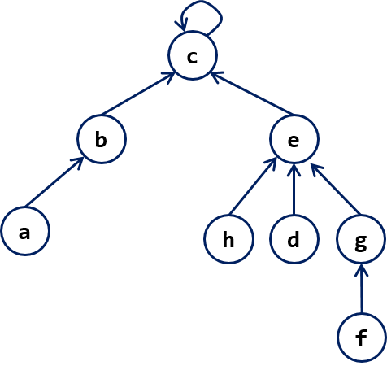
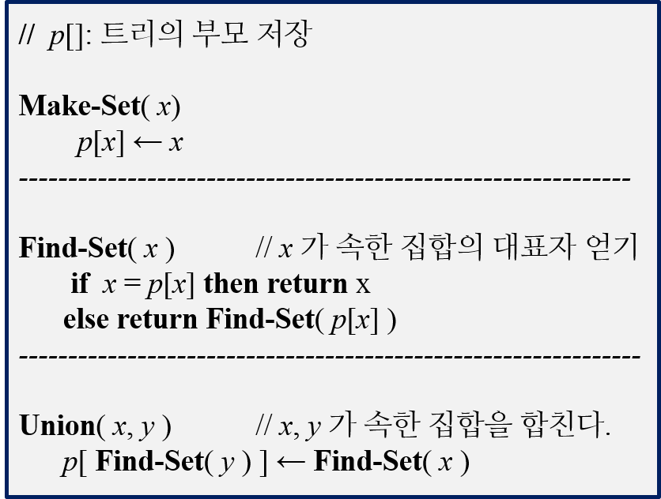
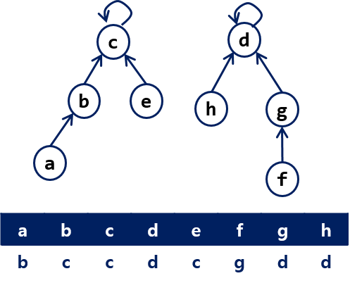
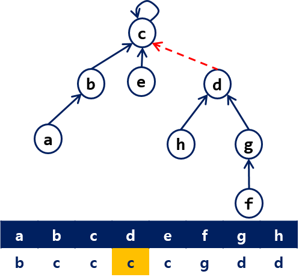
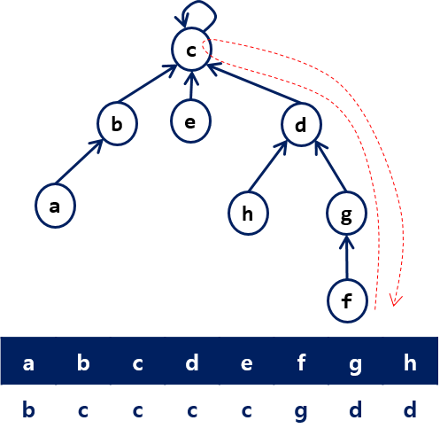
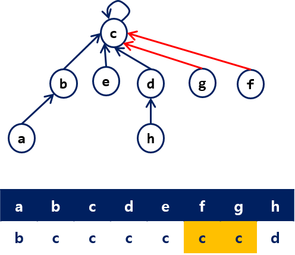
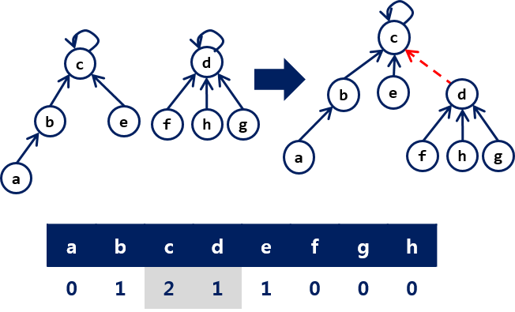
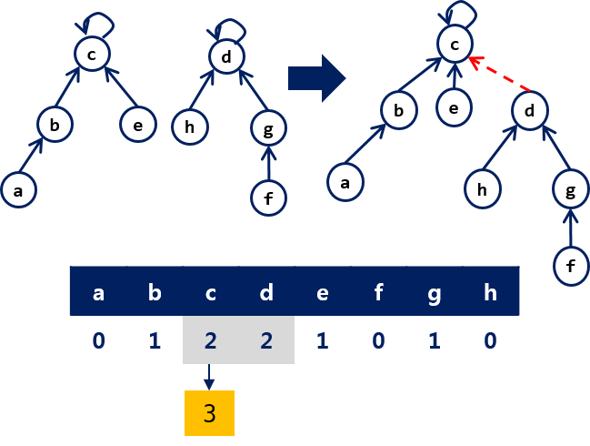
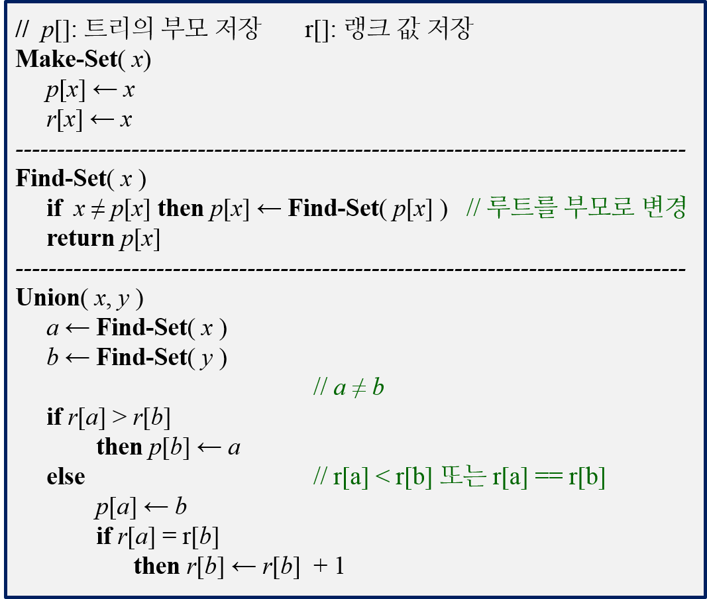

==========================================
Disjoint-Set
==========================================

.. index:: disjoint-set

.. admonition:: 상호배타 집합(Disjoint-Set)

    - 그래프에 간선이 추가되는 경우 연결된 컴포넌트(conntected component)들의 정보를 관리
    - 동적으로 변하는 그래프들의 정보 유지
    - Disjoint-Set Forests
    - 랭크값에 의한 결합(Union-by-Rank) and 경로 압축(Path Compression)
   
활용
==========================================   

Graph connectivity problem
------------------------------------

   - 무향 그래프가 있을때, 두 정점 u와 v의 연결 여부 확인하기

Dynamic connectivity problem
------------------------------------

   - 그래프에 간선이 추가되거나 삭제될 때, 두 정점의 연결 여부 확인하기
    
Incremental Connectivity problem
------------------------------------

   - 집합 분할(Set partition)과 같은 문제
   - 최초, 모든 노들들은 자기 자신을 포함하는 집합
   - 간선이 추가되면 간선의 두 정점이 속한 집합은 연결되고 집합으로 병합된다.
   - 두 정점의 연결성을 확인하는 것은 같은 집합인지 확인하는 것과 같다.
   

트리로 표현하기
==========================================   

    - 하나의 집합은 하나의 트리로 표현된다.
    - 집합에 속한 원소는 트리의 노드로 표현된다.
    - 각 노드는 부모 노드를 가리키도록 한다.
    - 루트 노드에 해당하는 원소가 집합의 대표자가 된다.

   

 
연산들
==========================================   

주요 연산은 다음과 같다.

- Make_Set(x): x를 원소로 하는 집합을 생성
- Find_Set(x): x를 원소로 하는 집합의 대표자를 반환
- Union(x, y): x, y 가 속한 집합을 합친다.

Union() 연산의 수행 과정   

   

   
경로 압축
==========================================   

원소가 속한 집합의 대표자를 얻기 위해서는 그 원소에서 루트까지 따라가는 작업을 수행해야 한다. 따라서, Find-Set()의 수행 시간은 루트까지의 거리에 비례한다.

- Find-Set()을 수행하는 과정에 만나는 모든 원소들이 대표자(루트)를 직접 가리키도록 설정
- 이후에, Find-Set()을 수행하는 과정에 루트까지 가는 경로를 줄인다.

다음 그림은 Find-Set(f) 수행하는 과정엣 경로 압축을 수행하는 과정을 보인다.

   

랭크에 의한 Union
==========================================   

트리의 높이가 높을 수록 Find-Set()의 수행 시간이 증가한다. 두 집합에 대한 Union() 연산의 결과로 생성되는 트리의 높이가 가능하면 증가하지 않는게 좋다.

이를 위해 각 원소에 대한 랭크 값을 저장한다.

- 초기 모든 원소의 랭크 값은 0이다.
- Union()시 두 집합의 대표자 중에 랭크 값이 작은 대표자의 부모를 큰 대표자로 변경한다. 

    - 트리의 높이가 증가하지 않는 경우이다.
    
- 랭크 값이 같을 경우에만 새로운 대표자의 랭크 값을 1 증가 시킨다.

   

랭크에 의한 Union
==========================================   

.. tip:: decremental connectivity

   - 차후 추가

