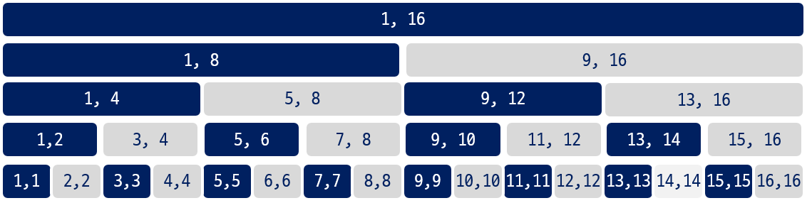
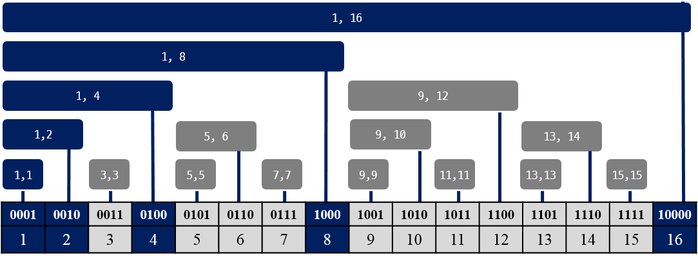
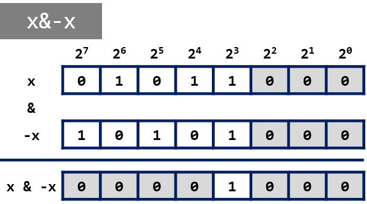
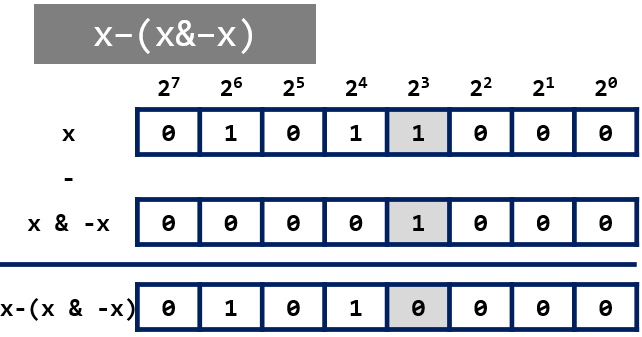
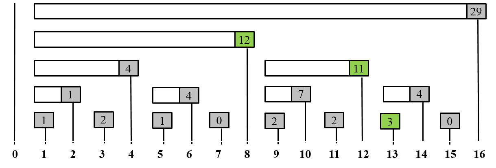
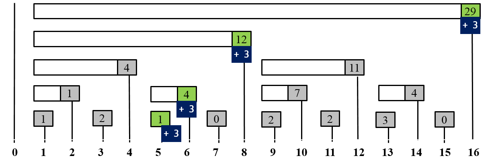
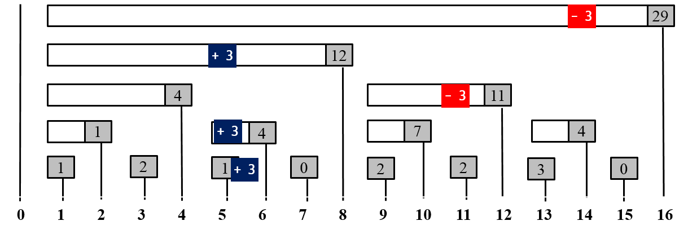

=========================
Binary Indexed Tree
=========================

이진 인덱스 트리는 효율적인 자료 압축을 위해 Fenwick [#fenwick]_ 이 고안하였다. **BIT** 라고 축약해서 표현하기도 하고, 펜윅(fenwick) 트리라고도 부른다.

.. admonition:: 아이디어

    - 정수는 2의 거듭제곱(:math:`2^n`)들의 합으로 표현된다.
    - 누적 빈도수는 하위 빈도수(subfrequency) 집합들의 합으로 표현된다.

.. admonition:: 특징

    - 구현이 쉽다
    - 이진 인덱스 트리에 대한 연산: :math:`O(\log n)`
    - 필요한 메모리: :math:`O(n)`
    - 다차원(n-dimensional) 자료 구조로 사용 가능하다.

다음 그림은 16개의 자료가 있을 때 이진 트리 형태로 구간들을 표현한 그림으로 세그먼트 트리와 동일하다. 
    

   
   < 16개 자료들이 있는 구간의 표현 >
   
세그먼트 트리와 달리 BIT는 그림에서 회색으로 칠해진 구간들은 제외하고, **진하게 색칠된 구간** 들을 저장한다.
   
BIT 표현
=====================================

그림은 [1, 16] 구간을 표현하기 위한 하위 구간들을 1 에서 16까지 값으로 대응시켜서 보여준다. BIT 는 각 구간에 대응하는 배열의 위치에 정보를 저장한다. 따라서, 자료 수 만큼의 공간이 필요하다.
   

   < [1, 16] 구간을 표현하는 BIT >

앞에서 정수 값은 2의 거듭제곱으로 표현할 수 있다고 언급했다. 위의 그림을 보고 알 수 있는 사실은 다음과 같다.

- 2의 거듭 제곱에 해당하는 인덱스 1, 2, 4, 8, 16은 모두 1번 부터 해당 인덱스까지의 구간을 나타낸다. 
- 즉, BIT 배열의 해당 위치에 저장되는 값은 1번 부터 해당 인덱스까지의 구간 정보를 저장한다.
- 최하위 비트가 1인 홀 수 인덱스들은 모두 구간의 크기가 모두 1인 것을 알 수 있다.
- 1번 부터 특정 인덱스까지의 구간은 최하위 비트를 제거하면서 찾을 수 있다.
    
    - 예를 들어, 1에서 13까지의 구간은 13, 12, 8 번을 모으면 된다. 
    - 13에서 12와 8을 추출하는 방법은 최하위 1의 값을 제거하면서 찾을 수 있다.
    - 13(1101) --> 12(1100) --> 8(1000)

- 특정 위치 값을 포함하는 구간들을 최하위 비트를 더하면서 찾을 수 있다.
    
..    //============== 주석 처리
    다음은 Fenwick [#fenwick]_ 의 논문에서 사용된 예제를 보여주는 그림이다. 

        - idx: 배열의 인덱스
        - f[i]: 인덱스 i 에 해당하는 값의 빈도수, ( i = 1. . . MaxVal)
        - c[i]: 인덱스 i 에 대한 누적 빈도수, (f [1] + f [2] + . . . + f [i])
        - tree [i]: BIT에서 인덱스 i 에 대응하는 구간의 빈도수들의 합    

    .. figure:: img/fenwick3.png
       :scale: 80%
       :align: center
       
       < 누적 빈도수에 대한 BIT 예제 >

  
마지막 1 추출하기
------------------------------

BIT를 사용하기 위해서 2진수 값의 마지막에 위치한 **1** 의 값을 뽑아야 한다. 
정수형 변수 **x** 에 저장된 (0101 1000)에 대해 최하위의 1비트만 남은 (0000 1000)을 추출하기 하기 위해 **x & -x** 의 수식을 사용한다.
**-x** 는 **x** 의 마지막 1비트의 왼쪽의 모든 비트들은 토글링되고 오른쪽은 모두 0이 된다.  따라서, x & -x 를 하게 되믄 최하위의 1 비트만 남게 된다.
   

   < 정수 **x** 에서 마지막 1 비트 추출 >

x 에서 (x & -x) 를 빼면 x에서 최하위 1 비트만 제거된다. 
   

   
   < 정수 **x** 에서 마지막 1 비트 제거 >

BIT를 이해하기 위해서는 최하위 1 비트를 제거하거나 최하위 1비트를 더하는 연산에 대한 이해가 필요하다.
   
   
BIT의 기본 연산
=========================================

BIT의 기본 연산은 다음과 같다. 

    - **update(p, v)** : p 인덱스 위치의 값에 v 를 더한다.
    - **query(r)** : [1, r] 구간에 대한 질의
    - **query(l, r)** : [l, r] 구간에 대한 질의 (1 <= l <= r <= N, N의 자료의 수)
    

구간 질의
-----------------------------

먼저, 구간에 대한 질의에 대해 알아보자. BIT는 누적된 구간합을 저장하는 형태이다. 따라서, [l, r] 구간은 [1, r] 구간합에서 [1, l-1]까지의 구간합을 빼서 구할 수 있다.

아래 그림은 앞에서 본 16개의 자료에 대한 정보를 저장한 BIT 예제이다. 
    
[1, 13] 구간 질의:
    - query(13)
    - 13은 2진수로 1101 이다. 
    - 13(1101)번 값 가져오기
    - 13(1001) - (0001) => 12(1100)
    - 12(1100)번 값 가져오기 
    - 12(1100) - (0100) => 8(1000)
    - 8(1000)번 값 가져오기 
    - 8(1000) - (1000) => 0 , 중단

    가져온 값들을 모두 더하면 에 저장된 값을 24가 된다. 
    

   < 구간 질의: query(13) >

[6, 13] 구간 질의:   
   - query(6, 13)
   - **query(13) - query(6)** 으로 구할 수 있다.

.. literalinclude:: code/fw_query.algo
   :language: c++
   :linenos:   

단일 값 갱신
-----------------------------
   
특정 위치의 자료 값이 변경되는 경우에 그 위치를 포함하는 구간 정보들을 수정되어야 한다. BIT에서 수정되어야 할 곳들을 어떻게 찾을 수 있을까?

    - 방법은 특정 위치의 인덱스 값에 포함된 최하위 비트를 더하고, 다시 변경된 인덱스 값의 최하위 비트를 더하면서 변경해 나간다.

다음은 update(5, 3), 즉 5번 값에 3을 더하는 경우 BIT의 변경되는 구간을 보여준다.

   < 단일 값 갱신: update(5, 3) >

5는 2진수로 0101 이다. 5번 값을 포함하는 구간은 마지막 1비트를 더해가면서 구할수 있다.   

- BIT[0101] + 3 수행
- 0101 에서 0001 을 추출하고 0101 + 0001 => 0110
- BIT[0110] + 3 수행
- 0110에서 0010 울 추출하고  0110 + 0010 => 1000
- BIT[1000] + 3 수행
- 1000에서 1000을 추출하고 1000 + 1000 => 10000
- BIT[10000] + 3 수행
- 10000은 자료수 16이므로 더 이상 진행하지 않는다.

.. literalinclude:: code/fw_update.algo
   :language: c++
   :linenos:  
   
BIT에 대한 기본 연산들을 이해했다면 조금 더 복잡한 연산들에 대해서 살펴본다.     
  
구간 갱신과 단일 값 질의
=========================================

- Range Updates and Point Queries
- 구간 갱신과 단일 값 질의 연산

    - update(l, r, v): [l, r] 구간에 +v 
    - queryRange(p): p위치의 값 질의

[l, r] 구간 갱신은 구간내에 포함된 모든 값들을 바꾸는 작업이다. 단일 값 갱신을 l부터 r까지에 대해 반복적으로 수행하면 된다. 좀더 효율적인 방법은 없을까?

    - [l, r] 구간에 + v 를 추가할때, l 위치 부터 끝가지 모든 자료들에 **+v** 를 하고 , r + 1 위치 이후의 모든 자료들에 대해 **-v** 를 하면 된다.

   
   < 구간 갱신: update(5, 11, +3) >

단일 값 질의는 앞에서 보인 방법과 동일하게 수행한다.
   
구간 갱신과 구간 질의
=========================================   

- Range Updates and Range Queries
- 구간 갱신과 구간 질의 연산

    - update(l, r, v): [l, r] 구간에 +v 
    - queryRange(l, r): [l, r] 구간 합 질의

쉽게 구현할 수 있는 방법은 앞에서 설명한 구간 갱신과 단일 값 질의 방법을 수행하면 된다. 즉, 구간 갱신 후에 구간의 모든 위치에 대해 단일 값 질의를 수행하면 된다.

구간 갱신과 구간 질의를 :math:`O(\log n)` 에 수행하는 방법이 있다. 구간 합을 구하기 위해 1번 부터 누적된 구간 합(prefix sum)을 사용해서 구하는 것을 이해했다.
    - query(l, r) = query(r) - query(l - 1)

[l, r] 구간이 갱신되고 나서, [0, k] (0 < k <= n, n자료수)에 대한 질의를 하는 경우에 k 는 다음 3가지 중에 하나이다. [#Geeks]_ 

#. **0 < k < l** :
    구간 갱신이 [0, k] 질의에 영향을 주지 않는다.

#. **l <= k <= r** :
    l 부터 k 까지 +v 가 된 상태라면, [0, k] 는 v * r - v *(l - 1) 로 구할 수 있다.

#. **r < k** :
    [l, r] 구간에 v가 더해진 상태이므로, 구간 갱신으로 인해 v * r - v * (l - r) 만큼 증가해야 된다.

1번의 경우는 구간 갱신전/후에 대해 구간 질의는 동일하다. 2번과 3번의 경우에 대해서 다시 살펴 보자.

2번의 경우:
    - 구간 합은 v*k - v*(l - 1) 만큼 증가한다. 여기서, v에 해당하는 값이 무엇일까?
    - v*k에 사용된 **v** 값은 앞서 설명한 **구간 갱신과 단일 값 질의 방법** 으로 찾는다.
    - 구간 갱신/단일값 질의를 위해 BIT(BIT1) 배열을 사용한다.
    - v*(l - 1)을 계산하기 위해 또 하나의 BIT(BIT2) 배열을 사용한다.
    - BIT2의 l 위치에 v*(l-1)을 갱신 해둔다.

3번의 경우:
    - BIT2를 이용해서 증가되는 값 v * r - v * (l - r)를 계산한다.
    - v * (l - r) - v * r 를 빼주면 동일한 결과가 된다. 
    - v * (l - r)은 2 번의 경우와 같고, v * r 의 값을 모든 갱신 작업시에 차감해 준다.

구간 갱신 작업: update(l, r, v)

    - update(BIT1, l, +v)
    - update(BIT1, r + 1, -v)
    - update(BIT2, l, v*(l - 1) )
    - update(BIT2, r + 1, -v*r)

구간 질의 작업: query(l, r)
    
    - query(BIT1, BIT2, k) = query(BIT1, k) * k - query(BIT2, k)    
    - query(BIT1, BIT2, l, r) = query(BIT1, BIT2, r) - query(BIT1, BIT2, l - 1)

추가할 내용
========================================

- Two dimensional binary indexed tree
- BIT를 사용한 counting inversion 

    
참고
=========================================
   
.. [#fenwick] `P. M. Fenwick, “A New Data Structure for Cumulative Frequency Tables,” Software: Practice and Experience, vol. 24, pp. 327–336, 1994.`
.. [#fw_topcoder] `Topcoder tutorial - Binary Indexed Tree, https://www.topcoder.com/community/data-science/data-science-tutorials/binary-indexed-trees/`
.. [#DIMA] `DIMA, Mircea, and Rodica CETERCHI. "Efficient Range Minimum Queries using Binary Indexed Trees." Olympiads in Informatics (2015): 39.`
.. [#Geeks] `Binary Indexed Tree: http://www.geeksforgeeks.org/binary-indexed-tree-range-update-range-queries/`