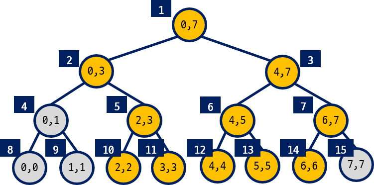
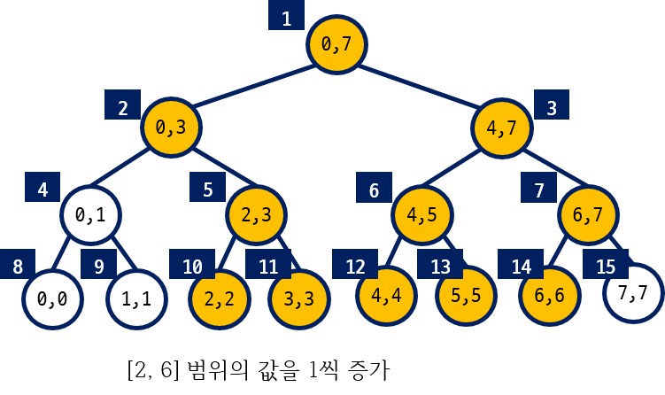
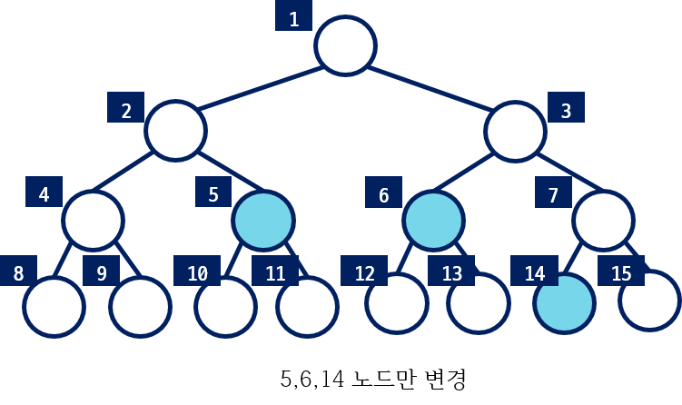
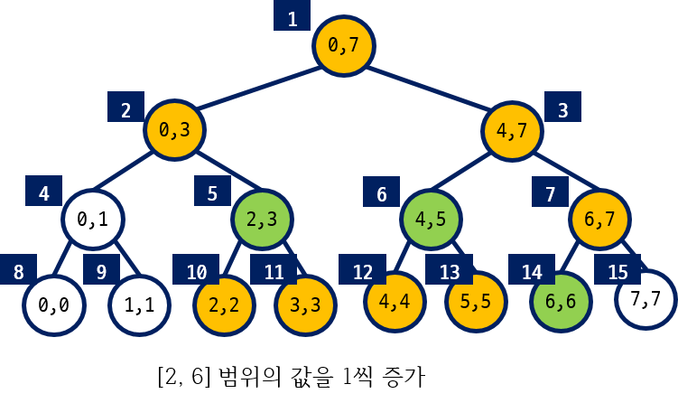
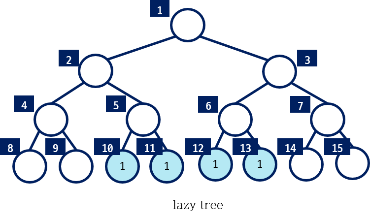
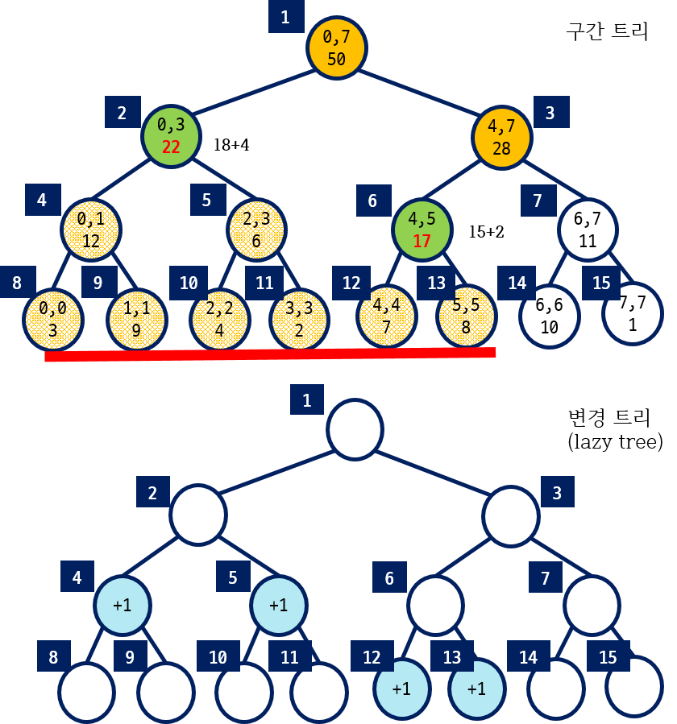
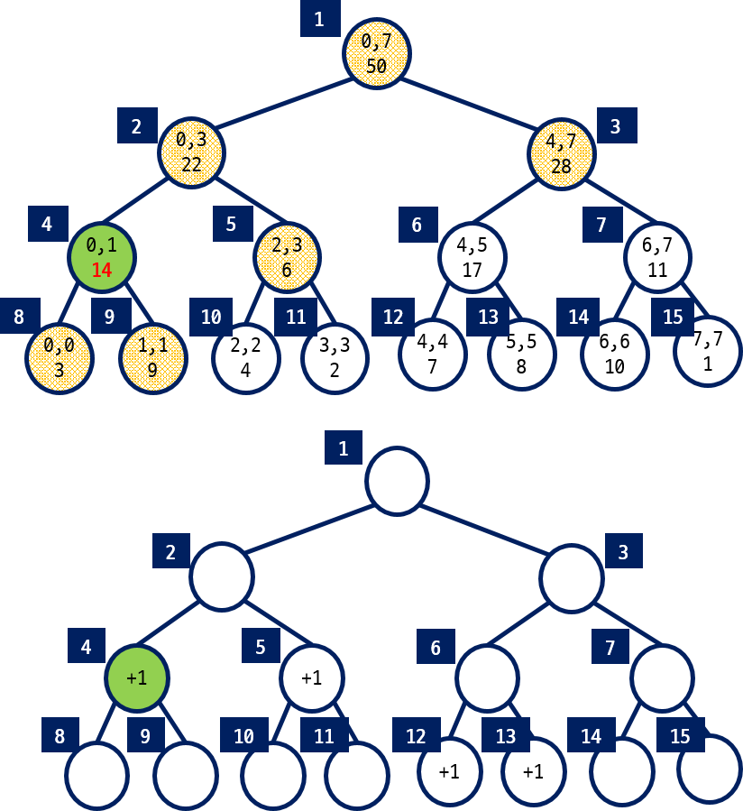
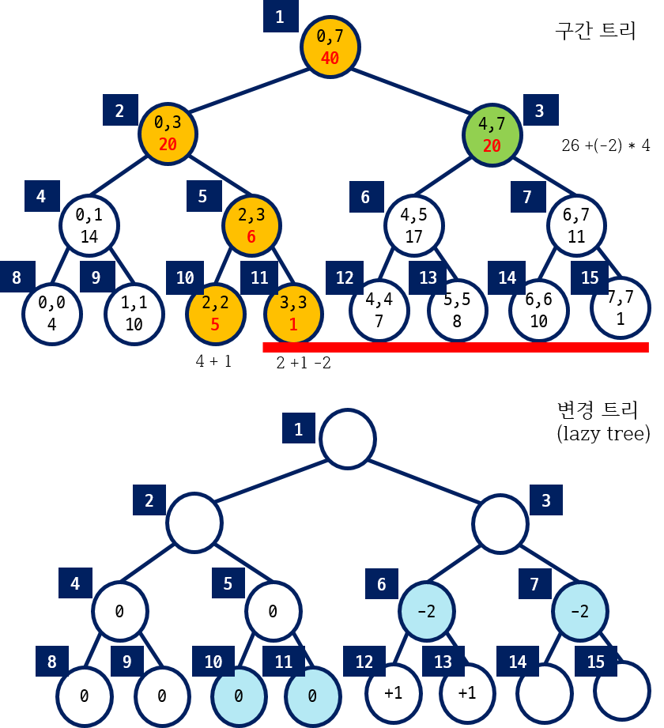

=========================
Segment Tree
=========================

- 균형잡힌 이진 탐색 트리 형태(Balanced binary search tree)

- 하나의 노드는 하나의 구간을 나타낸다.
    - 루트는 전체 구간, 단말 노드는 하나의 자료에 대응

- 연속적으로 저장된 자료들에서 구간에 포함된 자료들의 합이나 구간의 자료들 중 최소값을 구하는 경우에 효율적이다.

    - 자료 값들의 변경이 빈번하게 발생
    - RSQ(Range Sum Query), RMQ(Range Minimum Query)
    

구간 트리의 표현
=========================

- 트리의 높이에 대해 모든 노드들에 대한 공간을 확보한다.
- 이진 트리를 1차원 배열 형태로 표현한다. 
- 루트는 1번에 해당하고 i번째 노드의 왼쪽자식은 i*2 이고 오른쪽 자식은 i*2 + 1

.. warning::
    
    - 자료수 N이 2의 거듭제곱이 아닐 수 있음에 주의한다.

8개의 정수형 자료들 {3, 9, 4, 2, 7, 8, 10, 1} 가 있다. 자료수 :math:`N = 8` 이므로 높이(h) 3인 구간 트리를 생성할 수 있다. 높이가 3인 트리의 최대 노드 수는 :math:`2^{h+1}` 이고 :math:`2N - 1` 과 같다.

전체 구간은 시작 인덱스 0 부터 마지막 인덱스 7( :math:`= N - 1` )까지가 된다.
루트 노드는 전체 구간이 되고, 루트의 두 자식 노드는 분할된 왼쪽과 오른쪽 구간이 된다.
이렇게 분할 되면 마지막은 8개의 자료에 각각 대응하는 구간까지 표현할 수 있다.

.. figure:: img/segment1.png
   :scale: 60%
   :align: center
   
   < 8개의 자료에 대한 구간 트리 >

루트를 1번으로 왼쪽에서 오른쪽, 위에서 아래로 번호를 붙여가면 다음 그림과 같이 노드 번호를 부여할 수 있다.
노드 번호는 구간 트리를 저장하기 위한 배열의 인덱스로 사용한다. 
1차원 배열로 저장된 트리에서 현재 방문하는 노드 번호가 **i** 일때 **i*2** 와 **i*2+1** 가 자식들이 된다.

.. figure:: img/segment2.png
   :scale: 80%
   :align: center

   < 1차 배열로 구간 트리 표현 > 
   
.. literalinclude:: code/traversal.algo
   :language: c++
   :linenos:

구간 트리 생성 하기    
---------------------------------

다음은 N(= 8) 개의 자료들에 대한 구간 트리를 생성하는 코드이다.
   
.. literalinclude:: code/st_make.algo
   :language: c++
   :linenos: 

 
다음과 같이 자료가 10개가 있다면 높이가 4인 구간 트리가 필요하다.    
   
.. figure:: img/segment3.png
   :scale: 70%
   :align: center

높이가 **4** 인 완전 이진 트리의 노드 수는 :math:`2^5 - 1` 이다.   
다음은 노드 수가 N일 때 구간 트리를 저장하는 배열의 크기를 계산하는 코드이다. 
그렇지 않다면, **vector** 클래스를 사용해서 구현할 수 있다.

.. literalinclude:: code/treesize.algo
   :language: c++
   :linenos:

   
   
구간 질의
=========================

**[2, 6]** 구간의 합을 구하는 경우에 대해 생각해 보자.

.. figure:: img/segment4.png
   :scale: 70%
   :align: center

구간의 포함 관계
-------------------------------------------

.. figure:: img/segment_range1.png
   :scale: 70%
   :align: center  
   
- **구간합을 구할 구간: [s, e]**
- **노드의 구간: [l, r]**

    #. s ≤ l && r ≤ e
    #. r < s  ||  e < l
    #. 나머지

.. figure:: img/segment_range2.png
   :scale: 70%
   :align: center   
   
다음 그림은 **[0, 5]** 구간의 합을 구하는 경우이다.

.. figure:: img/segment5.png
   :scale: 70%
   :align: center

다음은 구간 **[a, b]** 에 포함된 자료들의 합을 구하는 코드이다.

.. literalinclude:: code/st_query.algo
   :language: c++
   :linenos:

단일 값 갱신
=========================

- 하나의 자료 값을 갱신하는 경우
- 구간에 포함된 자료 값들을 일괄적으로 갱신하는 경우

.. figure:: img/segment6.png
   :scale: 70%
   :align: center
   
다음은 하나의 자료 값을 갱신하는 코드이다.

.. literalinclude:: code/st_update.algo
   :language: c++
   :linenos:   

   
구간 갱신
=========================

구간 [s,e]의 자료들의 값을 일괄적으로 변경해보자. 예를 들어, [2, 6] 구간의 자료들을 모두 1씩 증가시켜 보자.  앞에서 설명한 단일 값 갱신을 구간 크기 만큼 반복하면 된다. 단일 값 갱신이 :math:`O(\log N)` 이므로 :math:`O(N \log N)`이 된다. 

보다 효율적인 방법은 없을까?

구간 갱신에 사용되는 **Lazy propagation** 에 대해서 알아보자. 

lazy propagation
----------------------------

- 구간합을 구하는 방법으로 변경한다.
- 하위 단말 노드부터 모든 노드를 변경하지 않는다.
- 구간 합을 구할 때 방문하는 노드들에 대해서만 먼저 변경한다.
- 이후 구간합을 구하거나 변경 작업이 필요할 때 나머지 노드에 대한 업데이트를 수행
- 구간 트리와 동일한 크기의 업데이트 트리(lazy tree)를 추가적으로 사용한다.

   

   
[2, 6] 구간 갱신
-------------------------------------------

[2, 6] 범위의 값을 1씩 증가:

    - 5, 6, 14 번 노드만 변경
    - 단말 노드가 아닌 5, 6번 노드의 자식 노드에 대해 차후 변경이 필요하다는 것을 저장 해둔다.

   
   < 구간 트리 >

   < lazy 트리 >
   
[0, 5] 구간 갱신
-------------------------------------------

[0, 5] 구간에 +1 하기:

- 구간 트리에서 색칠된 노드들의 변경이 필요하다.
- 루트에서 2, 6번 노드까지 만 방문한다.
- 이때, 2, 6번 노드의 자식 노드에 대해서 차후 변경할 정보를 저장해 둔다.

   
   < 구간 트리와 lazy 트리 >
   
- 2번, 6번 노드의 값은 구단의 크기 만큼 곱해서 변경한다.
    - 2번 노드의 구간은 [0, 3] 이므로 1*(3 – 0 + 1) 더한다.
    - 6번 노드는 구간은 1*(5 – 4 + 1) 더한다.

- 루트로 돌아가는 과정에서 만나는 노드들은 이전과 이전과 동일한 방법으로 변경된다.

[1, 3] 구간 질의하기
-------------------------------------------
   
[1, 3] 구간 합 질의:

    - 노드를 방문하는 과정에 변경 트리의 내용도 같이 확인한다.
    - 구간 트리의 색칠된 노드를 방문
    - 먼저, 4번 노드를 방문할 때 변경 트리의 내용을 반영해서 14로 변경한다.

   < 구간 트리와 lazy 트리 >
   
- 노드를 방문하는 과정에 변경 트리의 내용도 같이 확인한다.
- 구간 트리의 색칠된 노드를 방문
- 4번 노드를 방문할 때 변경 트리의 내용을 반영해서 14로 변경한다.
- 이때, 자식 노드에 대해 변경 트리에 내용을 전파하고 변경 트리 4번 노드 값은 0으로 변경한다.

.. figure:: img/segment_lazy7.png
   :scale: 70%
   :align: center

   < 구간 트리와 lazy 트리 >
      
- 8, 9번 노드를 방문하면서 변경 트리의 내용을반영한다.
- 8, 9번 노드는 자식이 없으므로 더 이상 변경 트리의 내용이 전파되지 않는다.
- 5번 노드를 방문하면서 변경트리의 내용을 반영하고 자식 노드들에 전파한다.

.. figure:: img/segment_lazy8.png
   :scale: 70%
   :align: center

   < 구간 트리와 lazy 트리 >

[3, 7] 구간 갱신하기
-------------------------------------------
   
[3, 7] 구간 -2 하기:

- 10번 노드는 변경 트리의 내용을 반영
- 11번 노드는 변경 트리의 내용과 -2를 반영
- 루트로 돌아가면서 조상 노드들에 대해 변경된 내용이 반영된다.
- 3번 노드를 방문하면서 구간합을 갱신하고 자식 노드에 변경할 내용을 변경 트리에 저장한다.

   < 구간 트리와 lazy 트리 >
   
다음은 구간에 포함된 자료들의 값을 갱신하는 코드이다.
갱신이 필요한 노드들은 **Laxy[]** 배열에 저장한다.
   
.. literalinclude:: code/st_update_range.algo
   :language: c++
   :linenos:   
   
구간 질의 + Lazy propagation
-----------------------------------
   
.. literalinclude:: code/st_query_range.algo
   :language: c++
   :linenos:

   
   